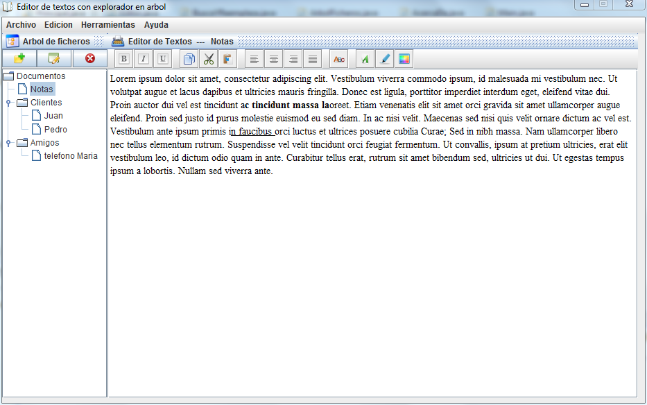
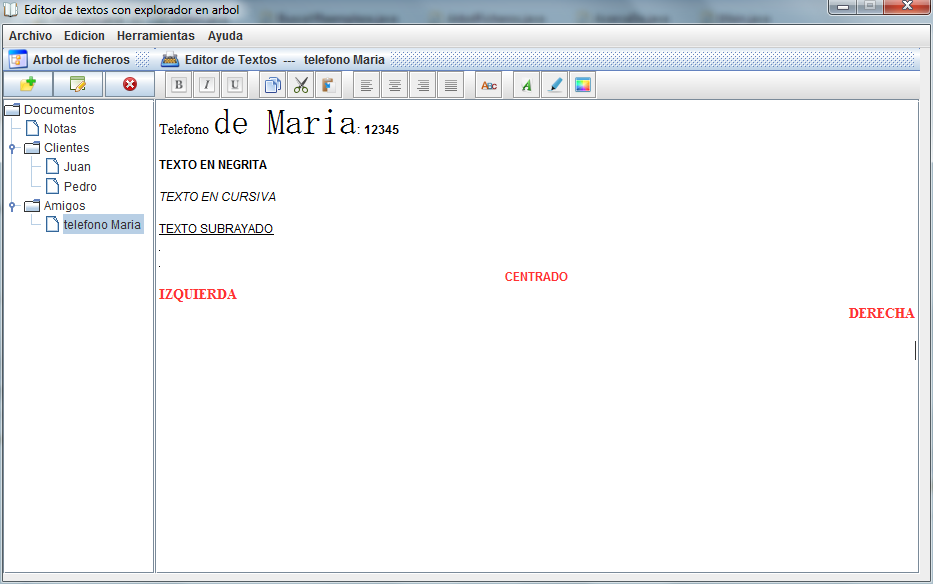
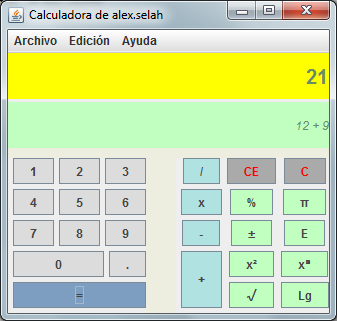

# EditorJtree
Editor de texto avanzado con explorador de archivos en árbol

>Este programa se distribuye bajo licencia p\u00fablica GNU-GPL. Forma parte del programa completo llamado
>Editor de texto con explorador en \u00e1rbol.
>Eres libre de copiar, distribur y mejorar el programa bajo los t\u00e9rminos de la licencia de la Free Software Foundation. Ante cualquier duda, p\u00f3ngase en contacto conmigo en el email arriba.

>Puede ver una traducci\u00f3n de la licencia GNU-GPL en espa\u00F1ol en el siguiente enlace:
>http://www.viti.es/gnu/licenses/gpl.html

>This file is part of Editor de texto con explorador en \u00e1rbol.
Editor de texto con explorador en arbol is free software: you can redistribute it and/or modify it under the terms of the GNU General Public License as published by the Free Software Foundation, either version 3 of the License, or (at your option) any later version.

>Editor de texto con explorador en arbol is distributed in the hope that it will be useful, but WITHOUT ANY WARRANTY; without even the implied warranty of MERCHANTABILITY or FITNESS FOR A PARTICULAR PURPOSE.  See the GNU General Public License for more details.
>You should have received a copy of the GNU General Public License along with Editor de texto con explorador en arbol.  If not, see <http://www.gnu.org/licenses/>.

Este editor pretende ser una ampliación del Bloc de Notas tradicional. Incorpora una vista en árbol donde podemos controlar los archivos que vamos creado.

Es un editor WYSIWYG, es decir, que lo que vemos es lo que obtenemos.

Los archivos son guardados como archivos independientes en una carpeta, con extensión .acf y en formateo HTML.

Como añadido adicional incorpora una calculadora. Es una prueba de concepto.

Este proyecto ha sido desarrollado como ejercicio de programación en Java para diversos trabajos de carrera.
